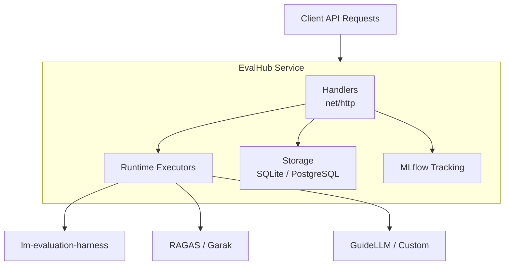

# EvalHub

[](https://github.com/eval-hub/eval-hub/actions/workflows/ci.yml)
[](https://pkg.go.dev/github.com/eval-hub/eval-hub)
[](https://goreportcard.com/report/github.com/eval-hub/eval-hub)

A lightweight REST API service for orchestrating LLM evaluations across multiple backends. Written in Go, it routes evaluation requests to frameworks like lm-evaluation-harness, RAGAS, Garak, and GuideLLM orchestrated via a [complementary SDK](https://github.com/eval-hub/eval-hub-sdk), tracks experiments via MLflow, and runs natively on OpenShift.

## Architecture



The service uses Go's standard `net/http` router, structured logging with zap, Prometheus metrics, and a pluggable storage layer (SQLite for development, PostgreSQL for production). Providers and benchmarks are declared in YAML configuration files shipped with the container image.

## Quick start

### Prerequisites

- Go 1.25+
- Make
- Podman (for container builds)
- Access to an OpenShift or Kubernetes cluster (for deployment)

### Run locally

```bash
make install-deps
make build
./bin/eval-hub
```

The API is available at `http://localhost:8080`. Interactive documentation is served at `/docs`.

### Run in a container

```bash
podman build -t eval-hub:latest -f Containerfile .
podman run --rm -p 8080:8080 eval-hub:latest
```

### Deploy to OpenShift

EvalHub is managed by the [TrustyAI Service Operator](https://github.com/trustyai-explainability/trustyai-service-operator) via a custom resource:

```yaml
apiVersion: trustyai.opendatahub.io/v1alpha1
kind: EvalHub
metadata:
  name: evalhub
  namespace: my-namespace
spec:
  replicas: 1
  env:
    - name: MLFLOW_TRACKING_URI
      value: "http://mlflow:5000"
```

Apply the CR to your cluster:

```bash
oc apply -f evalhub-cr.yaml
oc get evalhub -n my-namespace    # check status
```

## Local development

```bash
make start-service          # start in background (logs to bin/service.log)
make stop-service           # stop

make test                   # unit tests
make test-fvt               # BDD functional tests (godog)
make test-all               # both
make test-coverage          # generate coverage.html

make lint                   # go vet
make fmt                    # go fmt
```

Run a single test:

```bash
go test -v ./internal/handlers -run TestHandleName
```


To create a Python wheel distribution of the server for local development and testing:

```sh
make crosss-compile 
make build-wheel
```

### Database

SQLite in-memory is the default. For PostgreSQL:

```bash
make install-postgres && make start-postgres
make create-database && make create-user && make grant-permissions
```

Then set `DB_URL` to a PostgreSQL connection string.

## Configuration

Configuration is loaded from `config/config.yaml`, overridden by environment variables and secret files.

| Variable | Purpose | Default |
|---|---|---|
| `PORT` | API listen port | `8080` |
| `DB_URL` | Database connection string | SQLite in-memory |
| `MLFLOW_TRACKING_URI` | MLflow tracking server | `http://localhost:5000` |
| `MLFLOW_INSECURE_SKIP_VERIFY` | Skip TLS verification for MLflow | `false` |
| `LOG_LEVEL` | Logging level | `INFO` |

Provider configurations live in `config/providers/` as YAML files. The default set includes lm-evaluation-harness (167 benchmarks), RAGAS, Garak, GuideLLM, LightEval, and MTEB.

## API overview

All endpoints are versioned under `/api/v1`. Full specification at [eval-hub.github.io/eval-hub](https://eval-hub.github.io/eval-hub/).

| Endpoint | Methods | Description |
|---|---|---|
| `/api/v1/evaluations/jobs` | POST, GET | Create or list evaluation jobs |
| `/api/v1/evaluations/jobs/{id}` | GET, DELETE | Get status or cancel a job |
| `/api/v1/evaluations/collections` | GET, POST | List or create benchmark collections |
| `/api/v1/evaluations/providers` | GET | List registered providers |
| `/api/v1/evaluations/benchmarks` | GET | List available benchmarks |
| `/api/v1/health` | GET | Health check |
| `/metrics` | GET | Prometheus metrics |

Detailed API documentation: [eval-hub.github.io/eval-hub](https://eval-hub.github.io/eval-hub/)

## Custom backends

EvalHub supports Bring Your Own Framework (BYOF). Extend the `FrameworkAdapter` class from the [eval-hub-sdk](https://github.com/eval-hub/eval-hub-sdk) and implement a single method -- EvalHub handles scheduling, status reporting, and result aggregation.

```python
from evalhub.adapter import FrameworkAdapter, JobSpec, JobCallbacks, JobResults, EvaluationResult

class MyAdapter(FrameworkAdapter):
    def run_benchmark_job(self, config: JobSpec, callbacks: JobCallbacks) -> JobResults:
        # run your evaluation logic, report progress via callbacks
        callbacks.report_status(JobStatusUpdate(status=JobStatus.RUNNING, progress=0.5))
        score = evaluate(config.model, config.benchmark_config)
        return JobResults(
            id=config.id,
            benchmark_id=config.benchmark_id,
            model_name=config.model.name,
            results=[EvaluationResult(metric_name="accuracy", metric_value=score)],
            num_examples_evaluated=100,
            duration_seconds=elapsed,
        )
```

Register the new provider by adding a YAML entry to the providers ConfigMap. No additional services or TCP listeners are required -- adapters run as jobs, not servers. Once registered, the provider and its benchmarks are available through the standard `/api/v1/evaluations/providers` and `/api/v1/evaluations/benchmarks` endpoints.


## Project structure

```
eval-hub/
├── cmd/eval_hub/          # Entry point and server setup
├── internal/
│   ├── handlers/          # HTTP request handlers
│   ├── storage/           # Database abstraction (SQLite, PostgreSQL)
│   ├── mlflow/            # MLflow client
│   ├── runtimes/          # Backend execution adapters
│   ├── config/            # Viper-based configuration
│   ├── validation/        # Request validation
│   ├── metrics/           # Prometheus instrumentation
│   └── logging/           # Structured logging (zap)
├── config/                # config.yaml and provider definitions
├── api/                   # OpenAPI 3.1.0 specification
├── tests/features/        # BDD tests (godog)
├── Containerfile          # Multi-stage UBI9 container build
└── Makefile               # Build, test, and dev targets
```

## Further reading

- [API documentation](https://eval-hub.github.io/eval-hub/) -- full endpoint reference
- [CONTRIBUTING.md](./CONTRIBUTING.md) -- contribution guidelines
- [OpenAPI spec](./api/openapi.yaml) -- machine-readable API definition

## Licence

Apache 2.0 -- see [LICENSE](./LICENSE).
