# Eval Hub

[](https://github.com/ruivieira/eval-hub/actions/workflows/ci.yml)

An API REST server that serves as a routing and orchestration layer for evaluation backends on OpenShift.

## Overview

The Evaluation Hub is designed to:

- Parse requests containing lists of evaluations for each backend
- Support risk categories that automatically create appropriate benchmarks
- Route and orchestrate evaluation execution across multiple backends
- Store results in MLFlow experiment tracking server
- Aggregate and return responses to clients
- Handle requests concurrently and asynchronously
- Deploy as a container image on OpenShift (one per namespace)

## Features

- **Multi-Backend Support**: Orchestrates evaluations across different backends (lm-evaluation-harness, GuideLL, NeMo Evaluator, custom backends)
- **Collection Management**: Create, manage, and execute curated collections of benchmarks with weighted scoring and automated provider task aggregation
- **Native Collection Support**: Use `collection_id` directly in evaluation requests for automatic benchmark expansion and execution
- **Model Management**: Register and manage language models through API and environment variables
- **Provider & Benchmark Discovery**: Comprehensive API for discovering evaluation providers and their available benchmarks
- **Remote Container Integration**: NeMo Evaluator Executor for connecting to remote @Evaluator containers
- **Risk Category Automation**: Automatically generates appropriate benchmarks based on risk categories (low, medium, high, critical)
- **Async Execution**: Handles requests concurrently with progress tracking
- **MLFlow Integration**: Automatic experiment tracking and results storage
- **OpenShift Ready**: Containerized with Kubernetes/OpenShift deployment configurations
- **Monitoring**: Prometheus metrics and health checks
- **Scalable**: Horizontal pod autoscaling and configurable concurrency limits

## Architecture


### Core Components

1. **Request Parser**: Validates and expands evaluation specifications
2. **Evaluation Executor**: Orchestrates concurrent evaluation execution using executor pattern
3. **Executor Factory**: Creates and manages backend-specific executors
4. **MLFlow Client**: Manages experiment tracking and result storage
5. **Response Builder**: Aggregates results and builds comprehensive responses

## Quick Start

### Prerequisites

- Python 3.11+
- uv (for dependency management)
- Docker (for containerization)
- Kubernetes/OpenShift cluster (for deployment)
- MLFlow tracking server

### Local Development

1. **Clone and setup**:
   ```bash
   git clone <repository>
   cd eval-hub/poc
   uv venv
   source .venv/bin/activate  # On Windows: .venv\\Scripts\\activate
   uv pip install -e ".[dev]"
   ```

2. **Environment configuration**:
   ```bash
   cp .env.example .env
   # Edit .env with your configuration
   ```

3. **Run the service**:
   ```bash
   python -m eval_hub.main
   ```

4. **Access the API**:
   - API Documentation: http://localhost:8000/docs
   - Health Check: http://localhost:8000/api/v1/health
   - Metrics: http://localhost:8000/metrics

### Docker Deployment

1. **Build the image**:
   ```bash
   docker build -t eval-hub:latest .
   ```

2. **Run with Docker**:
   ```bash
   docker run -p 8000:8000 -e MLFLOW_TRACKING_URI=http://mlflow:5000 eval-hub:latest
   ```

### Kubernetes/OpenShift Deployment

1. **Deploy to cluster**:
   ```bash
   kubectl apply -k k8s/
   ```

2. **Check deployment**:
   ```bash
   kubectl get pods -n eval-hub
   kubectl logs -n eval-hub deployment/eval-hub
   ```

## API Usage

### Single Benchmark Evaluation (Simplified API)

**Endpoint**: `POST /api/v1/evaluations/benchmarks/{provider_id}/{benchmark_id}`

A simplified API for running a single benchmark evaluation, similar to Llama Stack's API. This endpoint automatically handles provider-to-backend mapping and simplifies the request structure.

**Example**:
```json
POST /api/v1/evaluations/benchmarks/lm_evaluation_harness/blimp
{
  "model": {
    "server": "vllm",
    "name": "tinyllama",
    "configuration": {
      "temperature": 0.0,
      "max_tokens": 512,
      "top_p": 0.95
    }
  },
  "timeout_minutes": 30,
  "retry_attempts": 1,
  "limit": 100,
  "num_fewshot": 0,
  "experiment_name": "Single Benchmark - Blimp",
  "tags": {
    "example_type": "single_benchmark"
  }
}
```

**Request Parameters**:
- `provider_id` (path): The provider identifier (e.g., `lm_evaluation_harness`)
- `benchmark_id` (path): The benchmark identifier (e.g., `blimp`)
- `model` (body, required): Model specification object with `server`, `name`, and optional `configuration` fields
- `timeout_minutes` (body, optional): Evaluation timeout in minutes (default: 60)
- `retry_attempts` (body, optional): Number of retry attempts (default: 3)
- `limit` (body, optional): Limit number of samples to evaluate
- `num_fewshot` (body, optional): Number of few-shot examples
- `experiment_name` (body, optional): MLFlow experiment name
- `tags` (body, optional): Additional tags for the evaluation

**Response**: Same as standard evaluation endpoint (see below)

## Collection Management

The Evaluation Hub includes a comprehensive collection management system for creating, managing, and executing curated collections of benchmarks with weighted scoring and automated provider task aggregation.

### Collection API Endpoints

#### List All Collections
**Endpoint**: `GET /api/v1/collections`

**Response**:
```json
{
  "collections": [
    {
      "collection_id": "coding_reasoning_v1",
      "name": "Coding & Reasoning Collection v1",
      "description": "A curated collection of coding and reasoning benchmarks",
      "provider_id": "lm_evaluation_harness",
      "benchmarks": [
        {
          "provider_id": "lm_evaluation_harness",
          "benchmark_id": "arc_easy",
          "weight": 1.5,
          "config": {
            "num_fewshot": 25,
            "limit": 100
          }
        },
        {
          "provider_id": "lm_evaluation_harness",
          "benchmark_id": "humaneval",
          "weight": 2.0,
          "config": {
            "num_fewshot": 0,
            "limit": 50
          }
        }
      ],
      "tags": ["coding", "reasoning", "v1"],
      "created_at": "2024-01-15T10:30:00Z"
    }
  ],
  "total_collections": 1
}
```

#### Get Collection by ID
**Endpoint**: `GET /api/v1/collections/{collection_id}`

**Example**:
```bash
curl "http://localhost:8000/api/v1/collections/coding_reasoning_v1"
```

#### Create New Collection
**Endpoint**: `POST /api/v1/collections`

**Request Body**:
```json
{
  "collection_id": "coding_reasoning_v1",
  "name": "Coding & Reasoning Collection v1",
  "description": "A curated collection of coding and reasoning benchmarks using available lm-evaluation-harness tasks",
  "tags": ["coding", "reasoning", "v1"],
  "benchmarks": [
    {
      "provider_id": "lm_evaluation_harness",
      "benchmark_id": "arc_easy",
      "weight": 1.5,
      "config": {
        "num_fewshot": 25,
        "limit": 100
      }
    },
    {
      "provider_id": "lm_evaluation_harness",
      "benchmark_id": "humaneval",
      "weight": 2.0,
      "config": {
        "num_fewshot": 0,
        "limit": 50
      }
    },
    {
      "provider_id": "lm_evaluation_harness",
      "benchmark_id": "mbpp",
      "weight": 2.0,
      "config": {
        "num_fewshot": 0,
        "limit": 50
      }
    },
    {
      "provider_id": "lm_evaluation_harness",
      "benchmark_id": "bbh",
      "weight": 1.5,
      "config": {
        "num_fewshot": 3,
        "limit": 100
      }
    }
  ],
  "metadata": {
    "created_by": "evaluation_team",
    "use_case": "coding_reasoning_assessment",
    "difficulty": "intermediate_to_hard",
    "estimated_duration_minutes": 30
  }
}
```

#### Update Collection
**Endpoint**: `PUT /api/v1/collections/{collection_id}`

#### Delete Collection
**Endpoint**: `DELETE /api/v1/collections/{collection_id}`

### Collection-Based Evaluations

#### Native Collection Support
Use `collection_id` directly in evaluation requests for automatic benchmark expansion and execution:

**Endpoint**: `POST /api/v1/evaluations`

**Example with collection_id**:
```json
{
  "request_id": "550e8400-e29b-41d4-a716-446655440000",
  "experiment_name": "Coding & Reasoning Collection Evaluation",
  "evaluations": [
    {
      "name": "TinyLlama Coding & Reasoning",
      "description": "Evaluation using coding_reasoning_v1 collection with automatic expansion",
      "model": {
        "server": "vllm",
        "name": "tinyllama",
        "configuration": {
          "temperature": 0.0,
          "max_tokens": 512,
          "top_p": 0.95
        }
      },
      "collection_id": "coding_reasoning_v1",
      "timeout_minutes": 60,
      "retry_attempts": 1
    }
  ],
  "tags": {
    "evaluation_type": "collection",
    "collection_id": "coding_reasoning_v1",
    "model_family": "llama"
  }
}
```

**How Collection Expansion Works**:
1. ✅ Eval-hub automatically looks up the collection by ID
2. ✅ Extracts all benchmarks from the collection
3. ✅ Groups benchmarks by provider for efficient execution
4. ✅ Creates appropriate backend configurations with preserved weights and configs
5. 🔄 Executes with proper task aggregation (e.g., LMEval runs all tasks in single Custom Resource)

#### Collection Processing Flow

```mermaid
flowchart TD
    A[🔍 Evaluation Request with collection_id] --> B[📋 Lookup Collection]
    B --> C[📦 Collection: coding_reasoning_v1]

    C --> D[🔄 Extract & Group Benchmarks]

    D --> E1[📊 lm_evaluation_harness Group]
    D --> E2[🔬 ragas Group]
    D --> E3[🛡️ garak Group]

    E1 --> F1["🎯 LMEval Backend Config
    - arc_easy (weight: 1.5)
    - humaneval (weight: 2.0)
    - mbpp (weight: 2.0)
    - bbh (weight: 1.5)"]
    E2 --> F2["🔍 RAGAS Backend Config
    - faithfulness
    - answer_relevancy"]
    E3 --> F3["🛡️ Garak Backend Config
    - toxicity
    - bias_detection"]

    F1 --> G1["⚡ LMEval Task Aggregation
    Single CR: [arc_easy, humaneval, mbpp, bbh]"]
    F2 --> G2["🔍 RAGAS Execution
    Individual benchmarks"]
    F3 --> G3["🛡️ Garak Execution
    Individual benchmarks"]

    G1 --> H[📊 Results Aggregation]
    G2 --> H
    G3 --> H

    H --> I["🎯 Weighted Final Score
    Based on collection weights"]

    style A fill:#e1f5fe
    style C fill:#fff3e0
    style D fill:#f3e5f5
    style E1 fill:#e8f5e8
    style E2 fill:#fff3e0
    style E3 fill:#fce4ec
    style H fill:#e0f2f1
    style I fill:#e1f5fe
```



**Key Processing Details**:
- **Provider Grouping**: Benchmarks automatically grouped by `provider_id` for optimal execution
- **Weight Preservation**: Individual benchmark weights maintained through the process
- **LMEval Optimization**: All lm-evaluation-harness tasks combined into single execution for efficiency
- **Config Inheritance**: Benchmark-specific configs (num_fewshot, limit) preserved per benchmark
- **Parallel Execution**: Different provider groups can execute in parallel
- **Result Aggregation**: Final scoring uses preserved weights for accurate collection-level metrics

### Provider & Benchmark Discovery

#### List All Providers
**Endpoint**: `GET /api/v1/providers`

**Response**:
```json
{
  "providers": [
    {
      "provider_id": "lm_evaluation_harness",
      "provider_name": "LM Evaluation Harness",
      "description": "Comprehensive evaluation framework for language models with 167 benchmarks",
      "provider_type": "builtin",
      "benchmark_count": 167
    }
  ],
  "total_providers": 4
}
```

#### Get Provider Details
**Endpoint**: `GET /api/v1/providers/{provider_id}`

#### List Provider Benchmarks
**Endpoint**: `GET /api/v1/providers/{provider_id}/benchmarks`

#### List All Benchmarks
**Endpoint**: `GET /api/v1/benchmarks`

**Query Parameters**:
- `category` (optional): Filter by benchmark category (e.g., "math", "code", "reasoning")
- `provider_id` (optional): Filter by provider

**Example**:
```bash
curl "http://localhost:8000/api/v1/benchmarks?category=code&provider_id=lm_evaluation_harness"
```

### Collection Best Practices

1. **Weighted Scoring**: Use benchmark weights to reflect importance in aggregate scoring
2. **Coherent Collections**: Group related benchmarks that assess similar capabilities
3. **Configuration Consistency**: Use consistent `num_fewshot` and `limit` settings within collections
4. **Descriptive Metadata**: Include comprehensive metadata for collection discovery and management
5. **Version Management**: Use version tags (v1, v2) for collection evolution
6. **Provider Optimization**: Group benchmarks by provider for efficient execution

### Creating an Evaluation Request

**Endpoint**: `POST /api/v1/evaluations`

**Example with explicit backends**:
```json
{
  "request_id": "550e8400-e29b-41d4-a716-446655440000",
  "experiment_name": "Explicit Backend Evaluation",
  "evaluations": [
    {
      "name": "TinyLlama Evaluation",
      "description": "Evaluation with explicit lm-evaluation-harness configuration",
      "model": {
        "server": "vllm",
        "name": "tinyllama",
        "configuration": {
          "temperature": 0.0,
          "max_tokens": 512,
          "top_p": 0.95
        }
      },
      "backends": [
        {
          "name": "lm-evaluation-harness",
          "type": "lm-evaluation-harness",
          "benchmarks": [
            {
              "name": "arc_easy",
              "tasks": ["arc_easy"],
              "num_fewshot": 5,
              "limit": 100
            }
          ]
        }
      ],
      "timeout_minutes": 30,
      "retry_attempts": 1
    }
  ]
}
```

**Example with risk category**:
```json
{
  "request_id": "550e8400-e29b-41d4-a716-446655440001",
  "experiment_name": "Risk-Based Evaluation",
  "evaluations": [
    {
      "name": "High Risk Model Evaluation",
      "description": "Evaluation using high risk category benchmarks",
      "model": {
        "server": "vllm",
        "name": "tinyllama",
        "configuration": {
          "temperature": 0.1,
          "max_tokens": 256
        }
      },
      "risk_category": "high",
      "timeout_minutes": 45,
      "retry_attempts": 2
    }
  ]
}
```

### Checking Evaluation Status

**Endpoint**: `GET /api/v1/evaluations/{id}`

**Response**:
```json
{
  "request_id": "550e8400-e29b-41d4-a716-446655440000",
  "status": "running",
  "total_evaluations": 3,
  "completed_evaluations": 1,
  "failed_evaluations": 0,
  "progress_percentage": 33.3,
  "results": [...],
  "aggregated_metrics": {...},
  "experiment_url": "http://mlflow:5000/#/experiments/1"
}
```

## Model Management

The Evaluation Hub includes a comprehensive model management system for registering and managing language models. Models can be registered through the REST API or configured at runtime via environment variables.

### Model API Endpoints

#### List All Models
**Endpoint**: `GET /api/v1/models`

**Query Parameters**:
- `include_inactive` (boolean, default: true): Include inactive models in results

**Example**:
```bash
curl "http://localhost:8000/api/v1/models?include_inactive=false"
```

**Response**:
```json
{
  "models": [
    {
      "model_id": "gpt-4-turbo",
      "model_name": "GPT-4 Turbo",
      "description": "OpenAI's GPT-4 Turbo model",
      "model_type": "openai",
      "base_url": "https://api.openai.com/v1",
      "status": "active",
      "tags": ["openai", "production"],
      "created_at": "2024-01-15T10:30:00Z"
    }
  ],
  "total_models": 1,
  "runtime_models": []
}
```

#### Get Model by ID
**Endpoint**: `GET /api/v1/models/{model_id}`

**Example**:
```bash
curl "http://localhost:8000/api/v1/models/gpt-4-turbo"
```

#### Register New Model
**Endpoint**: `POST /api/v1/models`

**Request Body**:
```json
{
  "model_id": "claude-3-sonnet",
  "model_name": "Claude 3 Sonnet",
  "description": "Anthropic's Claude 3 Sonnet model",
  "model_type": "anthropic",
  "base_url": "https://api.anthropic.com/v1",
  "api_key_required": true,
  "model_path": "claude-3-sonnet-20240229",
  "capabilities": {
    "max_tokens": 200000,
    "supports_streaming": true,
    "supports_function_calling": true,
    "supports_vision": true,
    "context_window": 200000
  },
  "config": {
    "temperature": 0.7,
    "max_tokens": 4000,
    "timeout": 60,
    "retry_attempts": 3
  },
  "status": "active",
  "tags": ["anthropic", "vision", "large-context"]
}
```

**Model Types**:
- `openai` - OpenAI models
- `anthropic` - Anthropic Claude models
- `huggingface` - Hugging Face models
- `ollama` - Ollama local models
- `vllm` - vLLM inference server
- `openai-compatible` - OpenAI-compatible APIs
- `custom` - Custom model implementations

#### Update Model
**Endpoint**: `PUT /api/v1/models/{model_id}`

**Request Body** (all fields optional):
```json
{
  "model_name": "Updated Model Name",
  "description": "Updated description",
  "status": "inactive",
  "tags": ["updated", "test"]
}
```

#### Delete Model
**Endpoint**: `DELETE /api/v1/models/{model_id}`

**Note**: Runtime models (configured via environment variables) cannot be deleted through the API.

#### Reload Runtime Models
**Endpoint**: `POST /api/v1/models/reload`

Reloads models configured via environment variables without restarting the service.

### Runtime Model Configuration

Models can be configured at runtime using environment variables, which is useful for deployment environments where you want to configure models without API calls.

#### Environment Variable Pattern
```bash
# Required: Model URL
EVAL_HUB_MODEL_<MODEL_ID>_URL=<model_api_url>

# Optional: Additional configuration
EVAL_HUB_MODEL_<MODEL_ID>_NAME=<human_readable_name>
EVAL_HUB_MODEL_<MODEL_ID>_TYPE=<model_type>
EVAL_HUB_MODEL_<MODEL_ID>_PATH=<model_path_or_identifier>
```

#### Examples

**OpenAI GPT-4**:
```bash
EVAL_HUB_MODEL_GPT4_URL=https://api.openai.com/v1
EVAL_HUB_MODEL_GPT4_NAME="Production GPT-4"
EVAL_HUB_MODEL_GPT4_TYPE=openai
EVAL_HUB_MODEL_GPT4_PATH=gpt-4
```

**Local vLLM Server**:
```bash
EVAL_HUB_MODEL_LLAMA2_URL=http://localhost:8080
EVAL_HUB_MODEL_LLAMA2_NAME="Local Llama 2"
EVAL_HUB_MODEL_LLAMA2_TYPE=vllm
EVAL_HUB_MODEL_LLAMA2_PATH=/models/llama-2-7b
```

**Anthropic Claude**:
```bash
EVAL_HUB_MODEL_CLAUDE_URL=https://api.anthropic.com/v1
EVAL_HUB_MODEL_CLAUDE_NAME="Claude 3 Sonnet"
EVAL_HUB_MODEL_CLAUDE_TYPE=anthropic
EVAL_HUB_MODEL_CLAUDE_PATH=claude-3-sonnet-20240229
```

**Generic OpenAI-Compatible API**:
```bash
EVAL_HUB_MODEL_CUSTOM_URL=https://my-custom-api.com/v1
EVAL_HUB_MODEL_CUSTOM_NAME="Custom Model"
EVAL_HUB_MODEL_CUSTOM_TYPE=openai-compatible
```

#### Environment Variable Defaults
- **Name**: `"Runtime Model <MODEL_ID>"` if not specified
- **Type**: `"openai-compatible"` if not specified or invalid
- **Path**: `null` if not specified
- **API Key Required**: `true` (default for security)
- **Status**: `active`
- **Tags**: `["runtime"]`

### Model Configuration Parameters

#### Model Capabilities
```json
{
  "max_tokens": 8192,              // Maximum tokens supported
  "supports_streaming": true,       // Streaming response support
  "supports_function_calling": true, // Function calling support
  "supports_vision": false,         // Vision/image input support
  "context_window": 8192           // Context window size
}
```

#### Model Configuration
```json
{
  "temperature": 0.7,           // Default temperature (0.0-2.0)
  "max_tokens": 2000,          // Default max tokens for responses
  "top_p": 0.9,               // Default top_p (0.0-1.0)
  "frequency_penalty": 0.0,    // Frequency penalty (-2.0-2.0)
  "presence_penalty": 0.0,     // Presence penalty (-2.0-2.0)
  "timeout": 30,              // Request timeout in seconds
  "retry_attempts": 3         // Number of retry attempts
}
```

#### Model Status
- `active` - Available for evaluations
- `inactive` - Unavailable for evaluations
- `testing` - Available but marked as testing
- `deprecated` - Marked for removal

### Using Models in Evaluations

Models registered through the model management system can be referenced by their `model_id` in evaluation requests:

```json
{
  "request_id": "550e8400-e29b-41d4-a716-446655440002",
  "experiment_name": "Claude 3 Evaluation",
  "evaluations": [
    {
      "name": "Claude 3 Evaluation",
      "description": "Evaluation using registered Claude 3 model",
      "model": {
        "server": "claude-server",
        "name": "claude-3-sonnet",
        "configuration": {
          "temperature": 0.7,
          "max_tokens": 4000
        }
      },
      "backends": [
        {
          "name": "lm-evaluation-harness",
          "type": "lm-evaluation-harness",
          "benchmarks": [
            {
              "name": "arc_easy",
              "tasks": ["arc_easy"],
              "num_fewshot": 5,
              "limit": 100
            }
          ]
        }
      ],
      "timeout_minutes": 60,
      "retry_attempts": 1
    }
  ]
}
```

### Model Management Best Practices

1. **Naming Convention**: Use consistent, descriptive model IDs (e.g., `gpt-4-turbo`, `claude-3-sonnet`)

2. **Environment Variables**: Use runtime configuration for:
   - Production deployments
   - CI/CD environments
   - Models with sensitive configuration

3. **API Registration**: Use API registration for:
   - Development environments
   - Dynamic model management
   - Models requiring frequent updates

4. **Security**:
   - Always set `api_key_required: true` for external APIs
   - Use environment variables for API keys, never hardcode them
   - Use HTTPS URLs for `base_url` in production

5. **Capabilities Tracking**: Accurately configure model capabilities to enable proper evaluation routing

6. **Status Management**: Use model status to control availability without deleting model configurations

### Model Validation

The system validates:
- **Model ID**: Must contain only letters, numbers, dots, hyphens, and underscores
- **Base URL**: Must be a valid HTTP or HTTPS URL
- **Model Type**: Must be one of the supported types
- **Configuration Ranges**: Temperature (0.0-2.0), top_p (0.0-1.0), penalties (-2.0-2.0)

### Troubleshooting Models

**Common Issues**:

1. **Model Not Found**: Check model ID spelling and ensure model is active
2. **API Connection Errors**: Verify base_url is accessible and API key is valid
3. **Validation Errors**: Check model_id format and configuration parameter ranges
4. **Runtime Model Issues**: Verify environment variable naming and restart service if needed

**Debug Commands**:
```bash
# List all models
curl http://localhost:8000/api/v1/models

# Check specific model
curl http://localhost:8000/api/v1/models/your-model-id

# Reload runtime models
curl -X POST http://localhost:8000/api/v1/models/reload

# Check service health
curl http://localhost:8000/api/v1/health
```

## Configuration

### Environment Variables

| Variable | Description | Default |
|----------|-------------|---------|
| `APP_NAME` | Application name | "Evaluation Hub" |
| `LOG_LEVEL` | Logging level | "INFO" |
| `API_HOST` | API bind host | "0.0.0.0" |
| `API_PORT` | API port | 8000 |
| `MLFLOW_TRACKING_URI` | MLFlow server URI | "http://localhost:5000" |
| `MAX_CONCURRENT_EVALUATIONS` | Max concurrent evaluations | 10 |

### Risk Category Configuration

Risk categories automatically select appropriate benchmarks:

- **Low**: Basic benchmarks (hellaswag, arc_easy)
- **Medium**: Standard benchmark suite
- **High**: Comprehensive evaluation
- **Critical**: Full benchmark suite with no limits

### Backend Configuration

Supported backends:
- **lm-evaluation-harness**: Standard language model evaluation
- **GuideLL**: Performance and latency evaluation
- **NeMo Evaluator**: Remote @Evaluator containers for distributed evaluation
- **Custom**: User-defined evaluation backends

#### NeMo Evaluator Integration

The eval-hub uses the NeMo Evaluator Executor to connect to remote @Evaluator containers, enabling distributed evaluation across multiple specialized containers. This allows you to:

- **Leverage specialized evaluation containers** deployed remotely
- **Distribute evaluation workloads** across multiple NeMo Evaluator instances
- **Use containerized evaluation frameworks** without local installation
- **Scale evaluation capacity** by connecting to multiple remote containers

##### Configuration Parameters

**Required Parameters**:
| Parameter | Description | Example |
|-----------|-------------|---------|
| `endpoint` | NeMo Evaluator container hostname/IP | `"nemo-evaluator.example.com"` |
| `model_endpoint` | Model API endpoint for evaluations | `"https://api.openai.com/v1/chat/completions"` |

**Optional Parameters**:
| Parameter | Type | Default | Description |
|-----------|------|---------|-------------|
| `port` | int | `3825` | NeMo Evaluator adapter port |
| `endpoint_type` | string | `"chat"` | API type: `chat`, `completions`, `vlm`, `embedding` |
| `api_key_env` | string | `null` | Environment variable containing API key |
| `timeout_seconds` | int | `3600` | Request timeout in seconds |
| `max_retries` | int | `3` | Maximum retry attempts |
| `verify_ssl` | bool | `true` | Verify SSL certificates |
| `auth_token` | string | `null` | Bearer token for container authentication |
| `health_check_endpoint` | string | `null` | Custom health check endpoint |
| `run_post_hooks` | bool | `false` | Trigger post-evaluation hooks |

**NeMo Evaluation Parameters**:
| Parameter | Type | Default | Description |
|-----------|------|---------|-------------|
| `framework_name` | string | `"eval-hub-client"` | Framework identifier |
| `command` | string | `"evaluate {{ config.type }}"` | Jinja2 command template |
| `limit_samples` | int | `null` | Limit evaluation samples (for testing) |
| `max_new_tokens` | int | `512` | Maximum tokens to generate |
| `parallelism` | int | `1` | Evaluation parallelism |
| `temperature` | float | `0.0` | Generation temperature |
| `top_p` | float | `0.95` | Top-p sampling parameter |
| `request_timeout` | int | `60` | Model API request timeout |

##### Usage Examples

**Single Remote Container**:
```json
{
  "request_id": "550e8400-e29b-41d4-a716-446655440003",
  "experiment_name": "NeMo Evaluator Single Container",
  "evaluations": [
    {
      "name": "GPT-4 Evaluation via NeMo",
      "description": "Remote evaluation using NeMo Evaluator container",
      "model": {
        "server": "openai",
        "name": "gpt-4-turbo",
        "configuration": {
          "temperature": 0.0,
          "max_tokens": 512
        }
      },
      "backends": [
        {
          "name": "remote-nemo",
          "type": "nemo-evaluator",
          "config": {
            "endpoint": "evaluator.company.com",
            "model_endpoint": "https://api.openai.com/v1/chat/completions",
            "api_key_env": "OPENAI_API_KEY"
          },
          "benchmarks": [
            {
              "name": "mmlu_pro",
              "tasks": ["mmlu_pro"],
              "config": {
                "limit": 100
              }
            }
          ]
        }
      ],
      "timeout_minutes": 60,
      "retry_attempts": 1
    }
  ]
}
```

**Multiple Specialized Containers**:
```json
{
  "request_id": "550e8400-e29b-41d4-a716-446655440004",
  "experiment_name": "Multi-Container NeMo Evaluation",
  "evaluations": [
    {
      "name": "Multi-Container Evaluation",
      "description": "Distributed evaluation across specialized NeMo containers",
      "model": {
        "server": "groq",
        "name": "llama-3.1-8b",
        "configuration": {
          "temperature": 0.1,
          "max_tokens": 512,
          "top_p": 0.95
        }
      },
      "backends": [
        {
          "name": "academic-evaluator",
          "type": "nemo-evaluator",
          "config": {
            "endpoint": "academic.eval.company.com",
            "model_endpoint": "https://api.groq.com/openai/v1/chat/completions",
            "api_key_env": "GROQ_API_KEY"
          },
          "benchmarks": [
            { "name": "mmlu_pro", "tasks": ["mmlu_pro"] },
            { "name": "arc_challenge", "tasks": ["arc_challenge"] }
          ]
        },
        {
          "name": "math-evaluator",
          "type": "nemo-evaluator",
          "config": {
            "endpoint": "math.eval.company.com",
            "model_endpoint": "https://api.groq.com/openai/v1/chat/completions",
            "api_key_env": "GROQ_API_KEY",
            "parallelism": 2
          },
          "benchmarks": [
            { "name": "gsm8k", "tasks": ["gsm8k"] },
            { "name": "math", "tasks": ["hendrycks_math"] }
          ]
        }
      ],
      "timeout_minutes": 120,
      "retry_attempts": 2
    }
  ]
}
```

**Local Development Setup**:
```json
{
  "name": "local-nemo",
  "type": "nemo-evaluator",
  "config": {
    "endpoint": "localhost",
    "port": 3825,
    "model_endpoint": "http://localhost:8000/v1/chat/completions",
    "endpoint_type": "chat",
    "verify_ssl": false
  }
}
```

##### API Communication

The NeMo Evaluator Executor communicates with remote containers using HTTP/JSON POST to `/evaluate`:

**Request Format**:
```json
{
  "command": "evaluate {{ config.type }}",
  "framework_name": "eval-hub-client",
  "pkg_name": "mmlu_pro",
  "config": {
    "output_dir": "/tmp/nemo_eval_uuid_benchmark",
    "params": {
      "limit_samples": 100,
      "max_new_tokens": 512,
      "parallelism": 4,
      "task": "mmlu_pro",
      "temperature": 0.0
    },
    "type": "mmlu_pro"
  },
  "target": {
    "api_endpoint": {
      "url": "https://api.openai.com/v1/chat/completions",
      "model_id": "gpt-4-turbo",
      "type": "chat",
      "api_key": "OPENAI_API_KEY"
    }
  }
}
```

**Response Format**:
```json
{
  "tasks": {
    "mmlu_pro": {
      "metrics": {
        "accuracy": {
          "scores": {
            "score": {
              "value": 0.85,
              "stats": {
                "count": 100,
                "mean": 0.85,
                "stddev": 0.12
              }
            }
          }
        }
      }
    }
  }
}
```

##### Error Handling & Performance

**Comprehensive Error Handling**:
- **Connection failures**: Automatic retry with exponential backoff
- **Timeout handling**: Configurable timeouts for long-running evaluations
- **Health check failures**: Warnings logged but execution continues
- **Response parsing errors**: Detailed error messages with response content

**Performance Optimization**:
- **Parallel Execution**: Configure `parallelism` for concurrent evaluation
- **Container Scaling**: Deploy specialized containers for different benchmark types
- **Resource Planning**: Consider CPU, memory, network bandwidth, and storage requirements

See `examples/configure_executors.py` for Python-only configuration examples.

## Monitoring

### Health Checks

- **Endpoint**: `/api/v1/health`
- **Kubernetes**: Liveness and readiness probes configured
- **Components**: MLFlow and service health

### Metrics

- **Endpoint**: `/metrics`
- **Format**: Prometheus metrics
- **Includes**: Request counts, duration, evaluation statistics

### Logging

- **Format**: Structured JSON logging (production) or console (development)
- **Levels**: DEBUG, INFO, WARNING, ERROR
- **Context**: Request IDs, evaluation IDs, correlation

## Development

### Project Structure

```
src/eval_hub/
├── api/              # FastAPI application and routes
├── core/             # Configuration, logging, exceptions
├── executors/        # Backend-specific executor implementations
│   ├── base.py       # Abstract Executor base class
│   ├── factory.py    # Executor factory for registration
│   └── nemo_evaluator.py  # NeMo Evaluator remote container executor
├── models/           # Pydantic data models
├── services/         # Business logic services
└── utils/            # Utility functions

examples/             # Python-only configuration examples
├── configure_executors.py  # Programmatic executor configuration
└── test_nemo_evaluator.py # Integration test script

k8s/                  # Kubernetes/OpenShift configurations
tests/                # Test suite
docker/               # Docker configurations
```

### Testing

```bash
# Run all tests
pytest

# Run with coverage
pytest --cov=src/eval_hub

# Run specific test categories
pytest -m unit
pytest -m integration
```

### Code Quality

```bash
# Format code
black src/ tests/

# Lint code
ruff src/ tests/

# Type checking
mypy src/
```

## Troubleshooting

### Common Issues

1. **MLFlow Connection Errors**:
   - Verify `MLFLOW_TRACKING_URI` is accessible
   - Check network connectivity and firewall rules

2. **Evaluation Timeouts**:
   - Increase `DEFAULT_TIMEOUT_MINUTES`
   - Check backend availability and performance

3. **Memory Issues**:
   - Reduce `MAX_CONCURRENT_EVALUATIONS`
   - Increase container memory limits

4. **NeMo Evaluator Connection Issues**:
   - **Connection refused**: Check endpoint hostname/IP and port
   - **Authentication errors**: Verify auth_token if required, check SSL certificate validity
   - **Evaluation timeouts**: Increase `timeout_seconds` for long evaluations, check container resource limits
   - **Model API errors**: Verify `model_endpoint` configuration, check API key environment variable

### Logs and Debugging

```bash
# View application logs
kubectl logs -n eval-hub deployment/eval-hub -f

# Check specific evaluation
curl http://eval-hub:8000/api/v1/evaluations/{id}

# Monitor system metrics
curl http://eval-hub:8000/metrics
```

## Contributing

1. Fork the repository
2. Create a feature branch
3. Make changes with tests
4. Run quality checks
5. Submit a pull request

## License

Apache 2.0 License - see LICENSE file for details.
